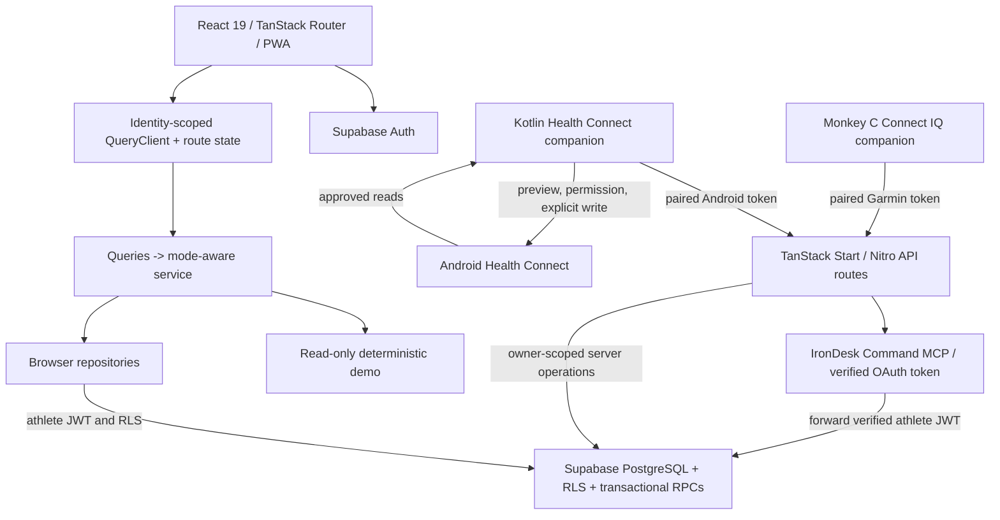

# IronDesk architecture

Source review: 2026-09-11 America/Los_Angeles (2026-09-12 UTC). Review baseline: GitHub main `c20635a`. This document describes the implementation plus the fixes on `codex/architecture-audit`; it is not a claim that this branch has been deployed.

## System and trust boundaries

IronDesk is a modular monolith with several clients. The browser talks directly to Supabase under the athlete's JWT and row-level security. TanStack Start/Nitro also hosts MCP, device and account-deletion endpoints. The device endpoints use server credentials only after resolving a purpose-bound device token to its owner. They must explicitly scope every operation because those credentials bypass RLS.

The separate `mobile-android` Compose app is an internal sample-only journal preview. It has no network permission, no authenticated backend and no release variant.

## Frontend and offline state

- `src/router.tsx` creates the router. `src/routes/__root.tsx` composes PWA, authentication, identity-scoped data, workout queue and route components.
- `AuthProvider` restores the browser session and determines live/demo/anonymous mode.
- `IdentityDataBoundary` keys the mounted data subtree by athlete identity and effective mode. Each scope owns a QueryClient; leaving a scope clears its private queries and mutation results and remounts route drafts. Token rotation retains the same scope.
- `AuthGate` handles sign-in/onboarding and blocks an initial failed account read with retry UI. Missing preferences cannot silently choose units. The existing offline terminal-receipt path remains available.
- Routes read React Query options through `useModeData`, `service.ts`, then either the deterministic demo service or `repo.ts`. Imports have their own query/repository boundary under the same identity-scoped provider.
- `derive.ts`, progression, training methods and program rules contain pure calculations. Kilograms are canonical; `units.ts` formats the athlete's selected display unit.
- The PWA service worker caches the application shell. The browser workout outbox persists user-scoped, replay-safe mutations. It is independent of the transient query cache and is preserved across normal sign-out. Completion receipts distinguish local completion from server acknowledgment.

The app is server rendered, but its live athlete data boundary is predominantly browser-side. AuthGate is a UX boundary; Supabase RLS and server credential validation enforce authorization.

## Database

Read-only inspection of the deployed public catalog found **30 tables, all with RLS enabled**. The model includes:

| Domain                     | Main tables                                                                           |
| -------------------------- | ------------------------------------------------------------------------------------- |
| Athlete                    | profiles, user_preferences, user_equipment, equipment_catalog                         |
| Library                    | exercises, exercise_favorites, workout_templates, template_exercises                  |
| Workout execution          | workout_sessions, session_exercises, workout_sets, cardio_sessions                    |
| Programs                   | programs, program_workouts, program_enrollments, scheduled_workouts                   |
| Training constraints       | training_specialization_windows, black_exposures                                      |
| Nutrition and recovery     | nutrition_days, meals, body_metrics, recovery_entries                                 |
| Import provenance          | data_sources, import_jobs, imported_activities, health_metrics, saved_import_mappings |
| Device identity and replay | device_pairings, device_links, connect_iq_event_receipts                              |

System exercises/templates/programs are shared read-only catalog entries; personal rows are owner scoped. Nested session/set/meal policies inherit access through their parent. Program enrollment and start operations use database functions; terminal workout transitions and Black application use transaction-backed RPCs.

The audit adds restrictive INSERT/UPDATE policies that require referenced parents to belong to the authenticated athlete for import jobs, imported activities, health metrics and cardio sessions. Existing ownership policies still apply. These changes do not rewrite existing rows.

The MCP recovery patch uses one SECURITY INVOKER `INSERT ... ON CONFLICT` transaction. It accepts only approved recovery fields, gets ownership from `auth.uid()`, preserves omitted real fields, and removes untouched demo measurements when replacing a sample entry.

**Rebuild limitation:** the checked-in migration chain and deployed migration history both omit the foundational program schema. Clean replay first fails at `20260826200646` because `public.program_workouts` does not exist. The audit's PGlite tests intentionally execute the affected, available migrations; they do not certify a full schema rebuild.

## MCP

`src/lib/mcp/index.ts` registers five tools using `@lovable.dev/mcp-js`:

| Tool                 | Behavior                                                                            |
| -------------------- | ----------------------------------------------------------------------------------- |
| list_recent_workouts | Reads the athlete's recent non-sample workouts                                      |
| get_workout_detail   | Reads one owned workout and its performed detail                                    |
| get_program_status   | Reads enrollment, program and upcoming schedule; a failed schedule read is an error |
| log_recovery         | Validates measurements and atomically patches one owned day                         |
| log_body_metric      | Validates and appends one body measurement; explicitly non-idempotent               |

The SDK adapters expose `/mcp`, tool discovery/invocation routes and OAuth protected-resource metadata. The issuer derives from the Supabase project ref. `supabaseForUser` creates a typed client that forwards the verified OAuth bearer token, with no persistent server session. The tool layer validates dates, units and database-compatible bounds before mutation. No tool accepts a caller-selected athlete ID.

## Garmin

The Monkey C client caches an active workout, logs canonical kilogram values, records FIT activity and queues stable event IDs. Checkpoints, queue limits, acknowledgment validation, event quarantine and origin binding protect offline state.

The Connect IQ v1 API resolves a Garmin token, returns the owned active workout and applies event batches through server logic and replay-aware database operations. Watch payloads never contain Supabase service credentials.

The audit compiled a fenix7 test build and ran all 13 simulator tests. It did not change Garmin source. The packaged origin remains `irondeskpro.lovable.app`; Android/web use `irondeskpro.com`. Changing the watch origin requires a deliberate pairing/data-binding transition and physical verification.

## Android Health Connect

The Kotlin companion has three distinct data flows:

1. User-selected, permission-approved Health Connect reads produce normalized records and a preview. Pagination fails explicitly if a bounded read cannot finish.
2. Explicit Sync Now uploads through the Android device token. A small encrypted outbox retains unsent batches, rejects overflow without eviction, stages file writes, and preserves data after revoked credentials.
3. The completed-workout export endpoint returns owned, completed, non-sample IronDesk sessions with performed-set notes. The companion previews them, requests exercise-write permission separately, then writes only after the user's action.

Stable `irondesk:workout:<UUID>` record identities and versions support repeat export/update. Inbound filtering recognizes IronDesk's own export origin and namespace to avoid loops. Historical set timings, GPS, heart-rate samples and calories are not invented.

Independent calorie/distance records remain available; merely ending during a workout no longer makes them that workout's totals. Device-derived recovery changes recheck source/owner at write time so a concurrent manual check-in wins.

## Workout content

Live read-only system catalog counts during the audit were **48 exercises, 34 templates, 213 template prescriptions, 6 programs and 34 program slots**. These counts exclude personal content and are a dated snapshot.

There are separate content paths:

- Twelve IronDesk Original templates and 62 prescribed movements, mirrored in demo content and migration seeds.
- Twenty-two Legacy Beta templates and 151 prescriptions, with four program definitions and provenance under `content/workouts/legacy-beta`.
- Twelve static no-gym follow-along sessions in `home-workouts.ts`, with Strength/Plyometrics/Speed/Conditioning filters and Starter/Build prescriptions. The checklist is transient and does not create a logged workout.
- Personal templates and live assignments in Supabase.

Catalog gates, acknowledgment requirements, method eligibility, sample exclusion and exercise evidence must be preserved when changing content. The app's deterministic AI Coach is not a live model. A shared generated content manifest is remaining debt, not an implemented part of this audit.

## Import and operational boundaries

FIT, TCX, GPX, CSV, JSON and ZIP data pass through bounded parsing, mapping, preview and provenance before persistence. File imports use job-owned batches and dedupe hashes; rollback removes that job's imported children. Device jobs also derive separate recovery/body rows and are audit history rather than general file rollback.

File import failures now retain acknowledged counts and explain partial saves. Connections refreshes its history after both success and failure. Import and device ingestion still span multiple requests; neither is a general transaction spanning all rows and metadata.

See the [audit](ARCHITECTURE_AUDIT_2026-09-11.md) for verification evidence, deployment prerequisites and prioritized remaining work.
